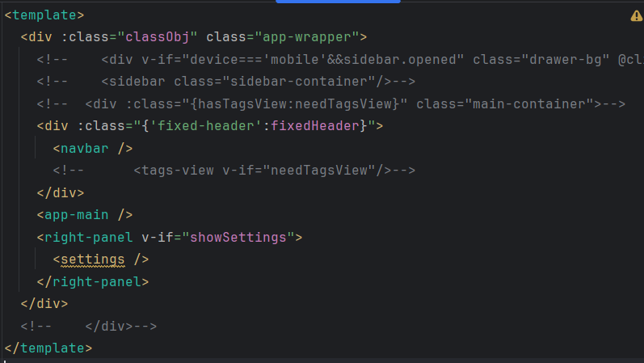

# 上列
#### src/layout/index.vue

#### src/layout/components/Navbar.vue
# 側選單 
#### src/router/index.js
目前已經註解
* permission
* icon
* documentation

# dashboard
#### src/views/dashboard/admin/index.vue
### 個人檔案 (已註解)
src/views/dashboard/admin/components/BoxCard.vue
### ToDo List(已註解)
### 訂單編號(已註解)
src/views/dashboard/admin/components/TransactionTable.vue

# 視窗分割
#### src/views/components-demo/split-pane.vue

# 新增一頁
```
改src/router/index.js
改src/views/test/index.vue
```
https://panjiachen.gitee.io/vue-element-admin-site/zh/guide/essentials/new-page.html#%E6%96%B0%E5%A2%9E-view